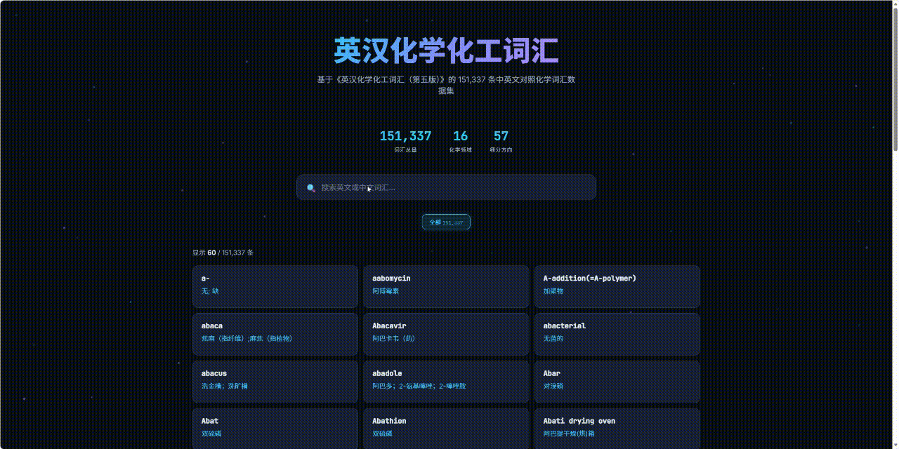

# English-Chinese Chemical Glossary

An open-source chemical glossary dataset based on *English-Chinese Chemical and Chemical Engineering Vocabulary (5th Edition)*.

🧪[中文版](docs/README_zh.md)



## Data Source

| Item | Info |
|------|------|
| **Book** | English-Chinese Chemical and Chemical Engineering Vocabulary (5th Edition) |
| **Publisher** | Science Press |
| **Editor** | Science Press Terminology Office |
| **ISBN** | 978-7-03-046913-7 |
| **Year** | 2016 |
| **Original Entries** | ~175,000 |
| **This Dataset** | **151,337** deduplicated entries |

> The 5th edition removed ~20,000 outdated/obsoletes and added ~20,000 new terms in materials science, chemical engineering, pharmaceutical chemistry, biochemistry, marine chemistry, and analytical techniques compared to the 4th edition (2000).

## Features

- **Large-scale**: 151,337 bilingual (EN-ZH) entries covering all chemistry sub-disciplines
- **Structured**: Each entry contains English term, Chinese definition, and domain classification tags
- **Multi-domain**: 16 chemistry domains, 57 sub-domains
- **Multi-format**: JSON, CSV, TXT
- **Free**: MIT License

## Data Structure

```
data/
├── glossary_all.json        # Full dataset (with domain classifications)
├── glossary.json            # Simple version (English + Chinese only)
├── glossary.csv             # CSV format, openable in Excel
├── glossary.txt             # Plain text, Tab-separated
├── domains/                 # Split by domain + sub-domain
├── by_domain.json           # Grouped by domain
└── statistics.json          # Statistics
```

### File Descriptions

#### glossary_all.json
Full dataset, 151,337 entries:
```json
{
  "en": "crystal",
  "zh": "晶体",
  "domains": [
    {"domain": "physical_chemistry", "sub_domain": "crystallography", "role": "primary", "confidence": 4.5}
  ]
}
```

#### glossary.json
Simplified version (English + Chinese only):
```json
{"en": "crystal", "zh": "晶体"}
```

#### glossary.csv
CSV format, two columns (English, Chinese), directly openable in Excel.

#### glossary.txt
Plain text, Tab-separated, one entry per line.

#### by_domain.json
Grouped by primary domain: `{"domain_name": [{"en":"...", "zh":"..."}]}`

#### statistics.json
Statistics including total entries, source info, and domain distribution.

#### domains/ directory
JSON files split by domain + sub-domain. Each entry includes `en`, `zh`, `role` (primary/secondary), `confidence`.

```
domains/
├── organic_chemistry/
│   ├── organic_synthesis.json
│   ├── organic_compounds.json
│   ├── natural_products.json
│   └── stereochemistry.json
├── inorganic_chemistry/
│   ├── coordination.json
│   ├── main_group.json
│   ├── transition_metals.json
│   └── solid_state.json
├── physical_chemistry/
│   ├── thermodynamics.json
│   ├── kinetics.json
│   ├── quantum_chemistry.json
│   ├── spectroscopy.json
│   ├── electrochemistry.json
│   ├── surface_science.json
│   ├── colloid_science.json
│   └── crystallography.json
├── analytical_chemistry/
├── biochemistry/
├── pharmaceutical_chemistry/
├── chemical_engineering/
├── materials_science/
├── polymer_science/
├── environmental_science/
├── food_science/
├── geological_chemistry/
├── nuclear_science/
└── general_chemistry/
```

## Domain Classification

Each entry's `domains` field:

```json
{
  "domain": "physical_chemistry",
  "sub_domain": "crystallography",
  "role": "primary",
  "confidence": 4.5
}
```

| Field | Type | Description |
|-------|------|-------------|
| `domain` | string | Primary domain (16 total) |
| `sub_domain` | string | Sub-domain (57 total) |
| `role` | string | `primary` = main domain, `secondary` = related domain |
| `confidence` | number | Score (higher = more precise). Threshold ≥ 1.5 |

### Multi-Domain Example

"catalyst" belongs to:
```json
[
  {"domain": "physical_chemistry", "sub_domain": "kinetics", "role": "primary"},
  {"domain": "catalysis", "sub_domain": "heterogeneous_catalysis", "role": "secondary"}
]
```

## Classification Method

**Ontology-based keyword rule classification** with a 3-tier matching strategy:

1. **Exact match** (+2.0): Entry directly hits domain keyword
2. **Regex pattern** (+1.5): Identifies chemical suffixes/formulas (e.g., `-ase` → enzymes)
3. **Partial match** (+1.0): Entry contains domain keyword

- Score ≥ 1.5 to be classified into a domain
- Highest score → `primary`, rest → `secondary`
- Max 3 domains per entry
- Unmatched entries → `general_chemistry`

| Metric | Value |
|--------|-------|
| Domains | 16 |
| Sub-domains | 57 |
| Keywords | ~2,000+ |
| Regex patterns | ~150+ |
| Speed | 151K entries / 68 seconds |

## Domain Distribution

| Domain | Key | Entries |
|--------|-----|---------|
| Environmental Science | environmental_science | 21,266 |
| Inorganic Chemistry | inorganic_chemistry | 20,312 |
| Organic Chemistry | organic_chemistry | 17,342 |
| Physical Chemistry | physical_chemistry | 15,865 |
| Chemical Engineering | chemical_engineering | 9,386 |
| Analytical Chemistry | analytical_chemistry | 6,914 |
| Materials Science | materials_science | 6,661 |
| Polymer Science | polymer_science | 4,400 |
| Pharmaceutical Chemistry | pharmaceutical_chemistry | 4,322 |
| Geological Chemistry | geological_chemistry | 3,817 |
| Biochemistry | biochemistry | 3,170 |
| Food Science | food_science | 2,072 |
| Dye & Pigment | dye_pigment | 925 |
| Catalysis | catalysis | 613 |
| Nuclear Science | nuclear_science | 548 |
| General Chemistry | general_chemistry | 93,393 |

## Visualization

An interactive web interface is included for browsing and searching the glossary.

### Quick Start

```bash
cd chemical-glossary
python scripts_internal/run.py
```

Opens http://localhost:7888 automatically. Press `Ctrl+C` to stop.

> Auto-switches to the next available port if 7888 is occupied.

### Features

- Search by English or Chinese term
- Filter by chemistry domain tags
- Hover to view domain classification
- Scroll-based loading for 151K entries

## Use Cases

- **NLP/ML**: Chemical word embeddings, NER training data
- **Translation**: Chemical terminology reference
- **Search**: Chemistry vocabulary search enhancement
- **Education**: Chemical vocabulary learning apps
- **Knowledge Graphs**: Entity library for chemical knowledge graphs
- **LLM**: Chemical domain RAG knowledge base

## License

MIT License - Free to use, modify, and distribute.

## Acknowledgments

Data sourced from *English-Chinese Chemical and Chemical Engineering Vocabulary (5th Edition)* (Science Press, 2016). This project is for academic research and educational purposes only.
